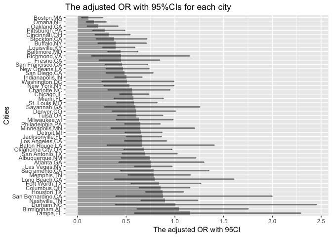

HW6
================
DZ
November 19, 2018

Problem 1
---------

#### Tidy data

``` r
df_homicide <- read_csv('./data/homicide_data.csv') %>%
  janitor::clean_names()%>%
  mutate(city_state = paste(city,state,sep = ',')) %>% 
  filter(city_state!='Dallas,TX'&city_state!='Phoenix,AZ'&city_state!='Kansas City,MO'&city_state!='Tulsa,AL') %>% 
  mutate(resolved = as.numeric(disposition == "Closed by arrest"),
         victim_race = as.factor(victim_race),
         victim_age = as.numeric(victim_age),
         victim_sex = as.factor(victim_sex)) %>% 
  mutate(victim_race = fct_recode(victim_race, 
                                  non_white='Asian',
                                  non_white='Black',
                                  non_white='Hispanic',
                                  non_white='Other',
                                  non_white='Unknown',
                                  white='White')) %>% 
  mutate(victim_race = fct_relevel(victim_race,'white'))
```

    ## Warning in evalq(as.numeric(victim_age), <environment>): NAs introduced by
    ## coercion

#### Baltimore,MD

``` r
glm.1 <- df_homicide %>% 
  filter(city_state=='Baltimore,MD') %>% 
  select(resolved, victim_age, victim_race, victim_sex) %>% 
  glm(resolved ~., data=., family = binomial()) 

glm.1.sum <- broom::tidy(glm.1) %>% 
  mutate(OR = exp(estimate)) %>%
  rename(log_OR = estimate) %>%
  select(term, log_OR , OR, p.value) 

conf_int.1 <- exp(confint(glm.1))
```

    ## Waiting for profiling to be done...

``` r
knitr::kable(cbind(glm.1.sum,conf_int.1)[,-1])
```

|                        |     log\_OR|         OR|    p.value|      2.5 %|     97.5 %|
|------------------------|-----------:|----------:|----------:|----------:|----------:|
| (Intercept)            |   1.1860305|  3.2740589|  0.0000004|  2.0759841|  5.2121977|
| victim\_age            |  -0.0069900|  0.9930344|  0.0321594|  0.9866654|  0.9993728|
| victim\_racenon\_white |  -0.8195997|  0.4406080|  0.0000027|  0.3121625|  0.6196693|
| victim\_sexMale        |  -0.8877869|  0.4115656|  0.0000000|  0.3148182|  0.5369411|

From this generalied linear model summary, we can conclude that homicides in which the victim is non-white are substantially less likely to be resolved that those in which the victim is white, the adjusted OR is 0.4406, 95%CI (0.312, 0.620).

#### Calculating OR and CI for each city

``` r
adjusted.or <- function(x){

  glm.1 <-glm(resolved ~victim_age+ victim_race+ victim_sex, data=x, family = binomial()) 

glm.1.sum <- broom::tidy(glm.1) %>% 
  mutate(OR = exp(estimate)) %>%
  rename(log_OR = estimate) %>%
  select(term, log_OR , OR, p.value) 

conf_int.1 <- exp(confint(glm.1))

cbind(glm.1.sum,conf_int.1)[3,-c(1,2)]


}

df_all_or <- nest(df_homicide,-city_state) %>% 
  mutate(adjusted_or = map(data,adjusted.or)) %>% 
  select(city_state,adjusted_or) %>%
  unnest %>% 
  rename(low.conf = '2.5 %', high.conf = '97.5 %') 

  knitr::kable(df_all_or)
```

| city\_state       |         OR|    p.value|   low.conf|  high.conf|
|:------------------|----------:|----------:|----------:|----------:|
| Albuquerque,NM    |  0.7414698|  0.2377043|  0.4493799|  1.2152560|
| Atlanta,GA        |  0.7528020|  0.3172864|  0.4244281|  1.2990553|
| Baltimore,MD      |  0.4406080|  0.0000027|  0.3121625|  0.6196693|
| Baton Rouge,LA    |  0.6676289|  0.2963820|  0.3043703|  1.4053484|
| Birmingham,AL     |  1.0392783|  0.8855421|  0.6116819|  1.7537500|
| Boston,MA         |  0.1145531|  0.0000017|  0.0425082|  0.2585157|
| Buffalo,NY        |  0.3898879|  0.0023055|  0.2100442|  0.7098745|
| Charlotte,NC      |  0.5575017|  0.0382543|  0.3131012|  0.9506573|
| Chicago,IL        |  0.5620844|  0.0000207|  0.4317557|  0.7342759|
| Cincinnati,OH     |  0.3183560|  0.0000428|  0.1799172|  0.5413058|
| Columbus,OH       |  0.8547029|  0.3029547|  0.6339316|  1.1527463|
| Denver,CO         |  0.6018870|  0.0541782|  0.3576083|  1.0076531|
| Detroit,MI        |  0.6512456|  0.0036337|  0.4874036|  0.8694509|
| Durham,NC         |  1.0028175|  0.9951589|  0.3902597|  2.4518708|
| Fort Worth,TX     |  0.8378356|  0.4007906|  0.5527861|  1.2636208|
| Fresno,CA         |  0.4478015|  0.0176545|  0.2223352|  0.8464094|
| Houston,TX        |  0.8726047|  0.2295200|  0.6984318|  1.0897262|
| Indianapolis,IN   |  0.5045560|  0.0000015|  0.3807758|  0.6652967|
| Jacksonville,FL   |  0.6581751|  0.0024149|  0.5017927|  0.8617718|
| Las Vegas,NV      |  0.7554159|  0.0299233|  0.5856215|  0.9720108|
| Long Beach,CA     |  0.7939031|  0.5280169|  0.3790487|  1.6055437|
| Los Angeles,CA    |  0.6658424|  0.0131181|  0.4812281|  0.9159985|
| Louisville,KY     |  0.3919136|  0.0000094|  0.2572275|  0.5899007|
| Memphis,TN        |  0.7823191|  0.2303081|  0.5191750|  1.1601053|
| Miami,FL          |  0.5762370|  0.0107597|  0.3771947|  0.8811103|
| Milwaukee,wI      |  0.6323892|  0.0457473|  0.3982950|  0.9815833|
| Minneapolis,MN    |  0.6457029|  0.1718976|  0.3409396|  1.2039975|
| Nashville,TN      |  0.8985913|  0.5107693|  0.6520114|  1.2339208|
| New Orleans,LA    |  0.4659337|  0.0010824|  0.2941343|  0.7371852|
| New York,NY       |  0.5314592|  0.0540473|  0.2706114|  0.9882814|
| Oakland,CA        |  0.2129779|  0.0000214|  0.0989172|  0.4181876|
| Oklahoma City,OK  |  0.6812533|  0.0337141|  0.4770878|  0.9696968|
| Omaha,NE          |  0.1689228|  0.0000000|  0.0907078|  0.2979582|
| Philadelphia,PA   |  0.6438263|  0.0021085|  0.4845237|  0.8500346|
| Pittsburgh,PA     |  0.2815606|  0.0000093|  0.1572504|  0.4852414|
| Richmond,VA       |  0.4474146|  0.1214624|  0.1442284|  1.1501093|
| San Antonio,TX    |  0.6893496|  0.0694756|  0.4585818|  1.0256000|
| Sacramento,CA     |  0.7807364|  0.3812291|  0.4431665|  1.3476441|
| Savannah,GA       |  0.5964045|  0.1802729|  0.2747498|  1.2579059|
| San Bernardino,CA |  0.8801457|  0.7564200|  0.3936535|  1.9991650|
| San Diego,CA      |  0.4833560|  0.0032977|  0.2943959|  0.7783316|
| San Francisco,CA  |  0.4582812|  0.0007982|  0.2880269|  0.7188686|
| St. Louis,MO      |  0.5770478|  0.0021851|  0.4045959|  0.8186394|
| Stockton,CA       |  0.3757201|  0.0030932|  0.1933475|  0.7127055|
| Tampa,FL          |  1.1588262|  0.6709560|  0.5848662|  2.2928961|
| Tulsa,OK          |  0.6024687|  0.0084916|  0.4112663|  0.8756132|
| Washington,DC     |  0.5100815|  0.0532959|  0.2497124|  0.9892888|

``` r
ggplot(df_all_or, aes(x=reorder(city_state, -OR),y=OR))+
    geom_histogram(stat = 'identity',alpha=.5)+
  geom_errorbar(mapping=aes(x=city_state, ymin=low.conf, ymax=high.conf), width=0.1, size=1, color="black",alpha=.5)+
    coord_flip()+
  xlab('Cities')+
  ylab('The adjusted OR with 95%CI')+
  ggtitle('The adjusted OR with 95%CIs for each city')
```



The smaller the adjusted OR suggests more race discrimination in resolving homicides. In this graph we can see that Boston has least race discrimination while Tempa has the highest. However, this trend cannot hold very strongly because some ORs are not statistically significant, probably due to small sample sizes.
